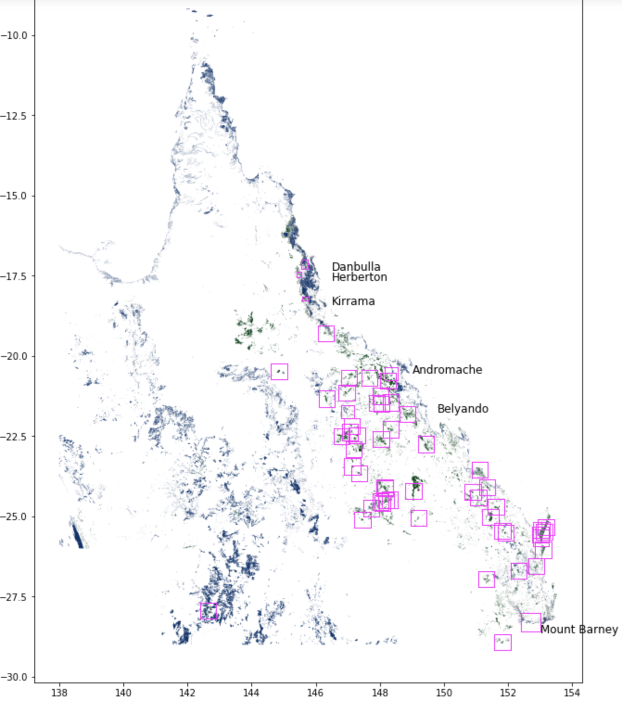
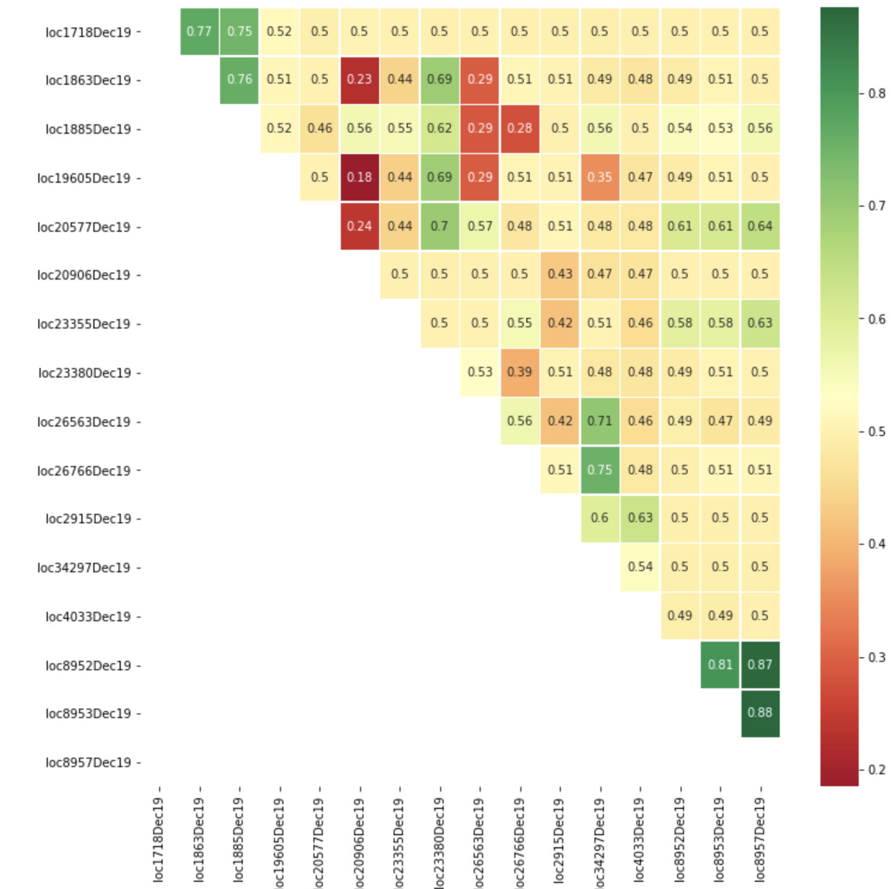

# Outline for a Study on Eucalyptus Remote Sensing Feasibility

## Initial observations regarding imagery resolution and number of spectral bands

Higher resolution imagery should decrease the number of boundary pixels with mixed vegetation.  However, initial investigation of handful of locations demonstrated that 11-band LandSat8 imagery had higher average prediction accuracies than 4-band Planet imagery.

Direct comparison of 4-band Planet imagery and 11-band LandSat8 imagery in the Herberton, Queensland location demonstrates a higher accuracy for the LandSat8 data.  This comparison can be examined here: [https://github.com/bwlambert/Eucalyptus_GLMClassifier/blob/master/HerbertonPlanetLandSat8.ipynb](https://github.com/bwlambert/Eucalyptus_GLMClassifier/blob/master/HerbertonPlanetLandSat8.ipynb) 

## Study Area

* Training Data:
    * Polygons from Queensland were divided into two groups:
        * Non-Eucalyptus EcoRegions
        * EcoRegions which were either Monospecies, Monogenus, or Monotribe Eucalyptus

Locations were selected in which Eucalyptus and non-Eucalyptus polygons were found in close proximity.  A handful of named locations were selected manually, while a large majority were selected programmaticaly.  All locations used are depicted in the following figure.

The code used to select locations can be found here: [https://github.com/bwlambert/Eucalyptus_GLMClassifier/blob/master/HuntPolys.ipynb](https://github.com/bwlambert/Eucalyptus_GLMClassifier/blob/master/HuntPolys.ipynb)

## Classification Approaches:
- Training and testing data were separated in the following two ways:
In the first approach a random 10% of pixels from labeled polygons were used to train the classifier, and the classifier was tested on the remaining 90% of pixels.

The behavior of classifiers built with this approach can then be used to determine the feasibility of Eucalyptus detection under favorable conditions, and to diagnose the impact of ecosystem "patchiness" on classification accuracy.  The following image plots balanced accuracy versus Cohen's Kappa for all programatically selected locations:

In the second approach the classifier was trained on all eucalyptus and non-eucalyptus pixels in a given location and tested on all other sample locations.  This approach permits a determination of distances across which classifiers retain accuracy and an examination of which attributes correlate with classification accuracy across space.  In addition to accuracy scores obtained between locations, Tanimoto similiarity scores were determined between each location for shared regional ecosystem codes and shared species.  Tanimoto scores for shared regional ecosystem codes correlate more strongly with classification accuracy than Tanimoto scores for species. Summary data for this approach is available here: [https://github.com/bwlambert/rse_outline/blob/master/cross_location_classification_data.csv](https://github.com/bwlambert/rse_outline/blob/master/cross_location_classification_data.csv) 

Code generating figures for most of these comparisons can be found here: [https://github.com/bwlambert/Eucalyptus_GLMClassifier/blob/master/Eucalyptus-SpectralAngle-GLM-Classifier-Summary.ipynb](https://github.com/bwlambert/Eucalyptus_GLMClassifier/blob/master/Eucalyptus-SpectralAngle-GLM-Classifier-Summary.ipynb)
## Classification Methods Employed:

Methods implemented by SpectralPython [https://github.com/spectralpython/spectral](https://github.com/spectralpython/spectral)
- [X] Gaussian Maximum Likelihood Classification (Empiricaly the best performing and undergirds 
- [X] Mahalanobis Distance Classifier
- [ ] Modified Spectral Angle Method

Methods implemented by Scikit-Learn [https://github.com/scikit-learn/scikit-learn](https://github.com/scikit-learn/scikit-learn)
- [X] Naive Bayes
- [ ] Decision Trees

